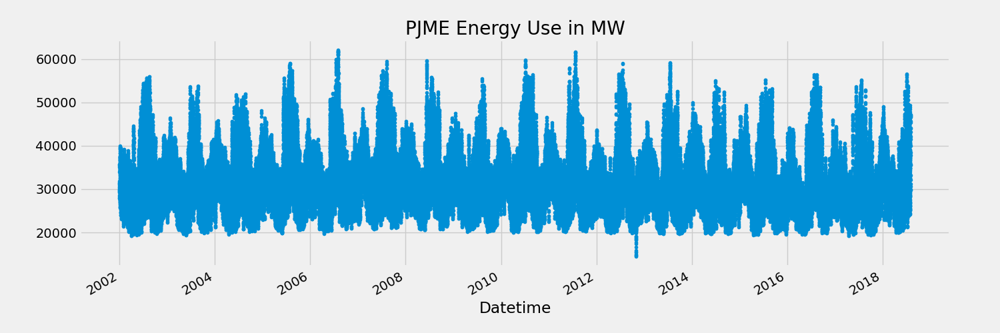
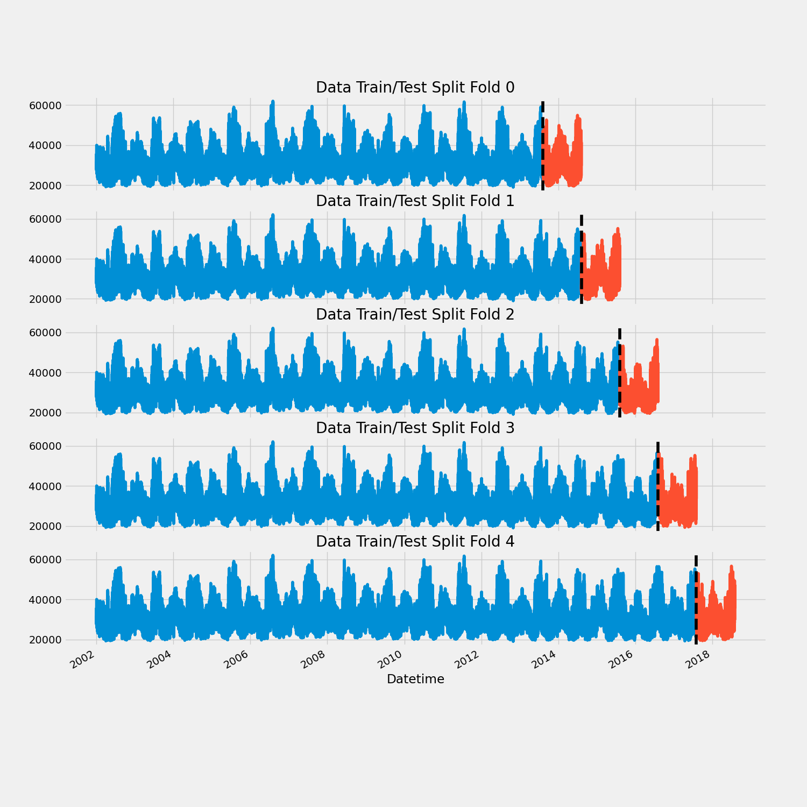
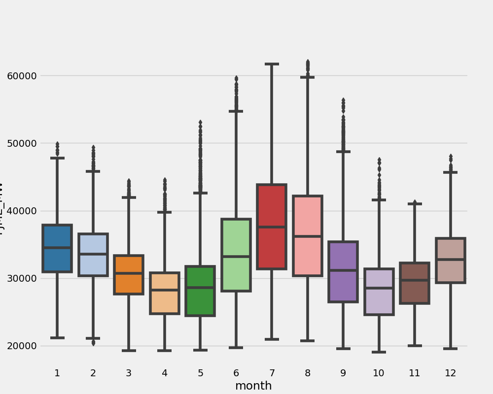
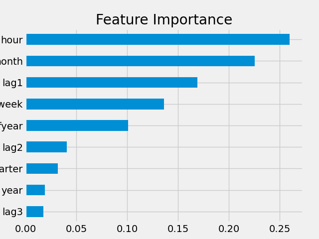
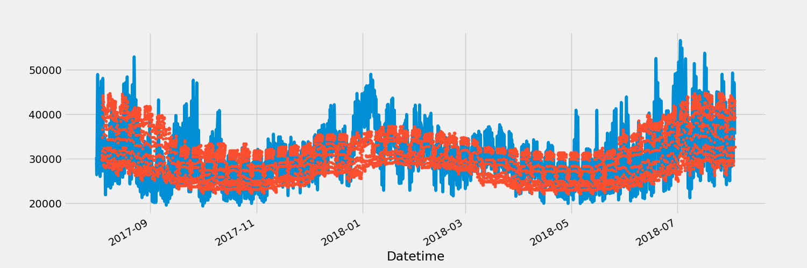
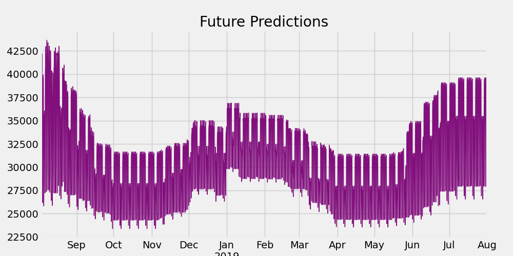

# Introduction
Dedicated project on Forecasting Energy Consumption with US energy consumption data using Python's XGBoost machine learning algorithm for time series data to discover insights from and make prediction on energy consumption usage in the US.

Check the detailled analysis out here: [Forecasting_Energy_Consumption folder](/)

This machine learning project was created by [Rob Mulla](https://www.youtube.com/watch?v=vV12dGe_Fho).

# Background
Transitioning from a data analyst to a professional data scientist, this project helped me to upskill my skills in data analytics, feature engineering, and forecasting time series data using advanced machine learning algorithms.

Data is retrieved from [Kaggle project](https://www.kaggle.com/code/deeplyft/timeseries-forecasting-with-xgboost/notebook).

# Tools I Used
For my deep dive into the development of machine learning model of the given time series data, I harnessed the power of several key tools:

- **Python** 
- **Jupyter Notebook**
- **Pandas**
- **XGBoost**
- **TimeSeriesSplit**

# The Analysis

### 1. Pull & Clean Data
To clean and manipulate the American energy consumption data (PJME), I used the [Forecasting_Energy_Consumption folder](/PJME_hourly.csv) file, set the datetime column to the index of the dataframe, and cleaned the data regarding any outliers.


*Line graph visualizing the US PJME Energy Use in MW, from 2002 to mid of 2018*

Here's the breakdown of the PJME energy consumption:
- **Consistency & Seasonality:** energy consumption, typically, from 20,000 MV to nearly 60,000 MV over all years, consistently, exhibiting recurring up and down swing patterns every year.
- **Outlier:** End of year 2010 shows outliers with 15.000 MW.

### 2. Train / Test Split 
To split the energy consumption data, I used the *TimeSeriesSplit* from from *sklearn.model_selection library*. The data is split using five partitions (folds), exhibiting a one year period for each test data to run multiple fitting rounds on different test sets.

```python
df = df.sort_index()

fig, axs = plt.subplots(5, 1, figsize=(15, 15), sharex=True)

fold = 0
for train_idx, val_idx in tss.split(df):
    train = df.iloc[train_idx]
    test = df.iloc[val_idx]
    train['PJME_MW'].plot(ax=axs[fold],
                          label='Training Set',
                          title=f'Data Train/Test Split Fold {fold}')
    test['PJME_MW'].plot(ax=axs[fold],
                         label='Test Set')
    axs[fold].axvline(test.index.min(), color='black', ls='--')
    fold += 1
plt.savefig("train_test_split_folds")
plt.show()
```


*Data train and test split with one year test size visualizing using five folds (i.e., splits)*

### 3. Feature Creation

The feature creation is based on the time series' index of the energy consumption data, e.g., hourly, monthly, and day of the year features, amongst others. See the following box plot for the MW by month feature, indicating on average higher consumption during the middle of the year.


*Box plot visualizing the ranges of the "MW by month feature"*

In addition, I created three lag features, commonly used in time series data, including one, two, and three years data shifts from the original PJME energy consumption data.

### 4. Train Using Cross Validation

``` python
FEATURES = ['dayofyear', 'hour', 'dayofweek', 'quarter', 'month','year',
                'lag1','lag2','lag3']
TARGET = 'PJME_MW'

preds = []
scores = []

for train_idx, val_idx in tss.split(df):
    # this part is the same as above
    
    train = df.iloc[train_idx]
    val = df.iloc[val_idx]

    train = create_features(train)
    val = create_features(val)

    X_train = train[FEATURES]
    y_train = train[TARGET]

    X_val = val[FEATURES]
    y_val = val[TARGET]

    reg = xgb.XGBRegressor(base_score=0.5, booster='gbtree',    
                           n_estimators=1000,
                           early_stopping_rounds=50,
                           objective='reg:squarederror',
                           max_depth=3,
                           learning_rate=0.01)
    reg.fit(X_train, y_train,
            eval_set=[(X_train, y_train), (X_val, y_val)],
            verbose=100)

    y_pred = reg.predict(X_val)
    preds.append(y_pred)
    score = np.sqrt(mean_squared_error(y_val, y_pred))
    scores.append(score)
```


*Feature importance of the model trained*


*Prediction plot over validation data set*

Here's the breakdown of the cross validation:
- **Model training score:** Average score across all folds result in a RMSE of 3682.6647.
- **Feature importance:** Hour and monthly features seem to have larger importance to the model, compared to yearly and the lag3 (i.e., three year lag) features.
- **Validation:** The model seems to slightly underfit the raw data, however, it smoothly captures the treand and seasonality of the validatin set.

### 5. Future Prediction

To predict the future using the trained model, I created a new dataframe for the one-year period ahead using all features (default). However, before creating the new dataframe, I run the machine learning model on the entire PJME energy consumption data set. After concatinating both dataframes, the future data is predicted and plotted using the updated model. Finally, the model is saved for future utilization.

``` python
df = create_features(df)

FEATURES = ['dayofyear', 'hour', 'dayofweek', 'quarter', 'month', 'year',
            'lag1','lag2','lag3']
TARGET = 'PJME_MW'

X_all = df[FEATURES]
y_all = df[TARGET]

reg = xgb.XGBRegressor(base_score=0.5,
                       booster='gbtree',    
                       n_estimators=500,
                       objective='reg:squarederror',
                       max_depth=3,
                       learning_rate=0.01)
reg.fit(X_all, y_all,
        eval_set=[(X_all, y_all)],
        verbose=100)

#Creating forecasting dataframe
future = pd.date_range('2018-08-03','2019-08-01', freq='1h')
future_df = pd.DataFrame(index=future)
future_df['isFuture'] = True
df['isFuture'] = False

df_and_future = pd.concat([df, future_df])
df_and_future = create_features(df_and_future)
df_and_future = add_lags(df_and_future)
```


*Forecasting the future of the energy consumption for the next year*


# What I Learned

Throughout this adventure, I've turbocharged my Data Science toolkit with some serious firepower:
- **Advanced Data Manipulation and Analysis:** I've deepened my proficiency in using Pandas and Numpy for sophisticated data manipulation and analysis, enabling me to prepare and analyze time series data effectively.
- **Data Visualization Mastery:** Through the use of Matplotlib and Seaborn, I've enhanced my skills in creating informative visualizations, which are crucial for understanding time series trends and forecasting results.
- **Machine Learning for Time Series Forecasting:** I've gained hands-on experience with machine learning modeling, specifically using libraries like scikit-learn and XGBoost. This allowed me to build and tune predictive models tailored to forecasting energy consumption.
- **Library Integration and Application:** The project saw the application of a diverse set of Python libraries, including but not limited to sklearn for model building and evaluation, as well as XGBoost for more advanced, ensemble-based modeling techniques. This broadened my exposure to and understanding of Python's data science ecosystem.

# Conclusions

### Insights

The analysis and modeling of energy consumption data have yielded several key insights that are instrumental for understanding consumption patterns, forecasting accuracy, and model performance:
- **Consistency and Seasonality**: The dataset exhibits a clear pattern of consistency and seasonality in energy consumption, ranging from 20,000 MW to nearly 60,000 MW across the years. This pattern includes regular fluctuations that suggest a predictable yearly cycle of energy usage highs and lows.
- **Outlier Detection**: An anomaly was detected at the end of 2010, where energy consumption dropped significantly to 15,000 MW. This outlier could be indicative of external factors affecting energy usage or data collection anomalies and warrants further investigation.
- **Model Performance**: The forecasting model achieved an average Root Mean Square Error (RMSE) of 3682.6647 across all validation folds. This metric indicates the model's prediction accuracy, with a lower RMSE value reflecting closer fit to the actual data points.
- **Feature Importance**: Analysis of feature importance revealed that hourly and monthly attributes significantly influence the model's predictions, more so than yearly trends or the three-year lag feature. This insight suggests that short-term temporal factors play a crucial role in forecasting energy consumption, potentially more than long-term historical patterns.
- **Model Validation**: Despite a tendency to slightly underfit the raw data, the model effectively captures the overarching trend and seasonality within the validation set. This performance indicates a balance between model complexity and its ability to generalize, albeit with room for improvement in fitting the finer details of the dataset.

These insights offer valuable perspectives for refining energy consumption forecasts, highlighting the importance of temporal dynamics and the potential impact of anomalies on predictive accuracy. Further model tuning and investigation into outliers could enhance future forecasting efforts.


### Closing Thoughts

This project underscores the dynamic and multifaceted nature of energy consumption forecasting. The insights derived not only show the path towards more accurate models but also highlight the critical role of temporal analysis and anomaly investigation in enhancing energy management strategies.
